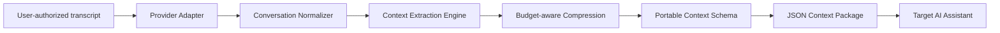

<div align="center">

# 🌉 ContextBridge AI

### Take your AI conversation with you.

**A provider-neutral context portability layer for moving useful conversational memory across AI assistants.**

`ChatGPT ↔ Claude ↔ Gemini ↔ Any LLM`

<br/>


<br/>

**Conversation → Understand → Compress → Package → Continue**

</div>

---

## ✨ The Idea

You spend an hour solving a problem with one AI assistant. It now understands your requirements, decisions, constraints, unfinished tasks and the direction of your work.

Then you switch to another assistant.

And suddenly you are starting from zero.

**ContextBridge AI is designed to solve that problem.**

Instead of treating a conversation as a giant block of text, ContextBridge turns it into a compact, structured **portable context package** that another AI system can consume.

> The goal is not to copy every message. The goal is to preserve what the next AI actually needs to know.

---

## 🧠 What Makes ContextBridge Different?

A normal export preserves the **transcript**.

ContextBridge preserves the **meaning of the work**.

<table>
<tr>
<td width="33%" align="center"><b>01 — Understand</b><br/><br/>Normalize conversation history into a provider-independent representation.</td>
<td width="33%" align="center"><b>02 — Distill</b><br/><br/>Extract decisions, facts, requirements, tasks and high-value conversational context.</td>
<td width="33%" align="center"><b>03 — Transfer</b><br/><br/>Create a lightweight context package that can travel to another AI environment.</td>
</tr>
</table>

---

## 🌐 The Context Bridge

```text
┌─────────────────┐
│    ChatGPT      │
└────────┬────────┘
         │
┌────────▼────────┐       ┌─────────────────┐
│     Claude      │──────►│                 │
└─────────────────┘       │  CONTEXTBRIDGE  │
                          │                 │
┌─────────────────┐       │   Normalize     │
│     Gemini      │──────►│   Understand    │
└─────────────────┘       │   Compress      │
                          │   Structure      │
┌─────────────────┐       │                 │
│    Any LLM      │──────►│       AI        │
└─────────────────┘       └────────┬────────┘
                                   │
                                   ▼
                         ┌────────────────────┐
                         │ PORTABLE CONTEXT   │
                         │ ✓ Facts            │
                         │ ✓ Decisions        │
                         │ ✓ Requirements     │
                         │ ✓ Open Tasks       │
                         │ ✓ Key History      │
                         │ ✓ Summary          │
                         └─────────┬──────────┘
                                   │
                    ┌──────────────┼──────────────┐
                    ▼              ▼              ▼
                 ChatGPT        Claude         Gemini
```

---

## 🔥 Current Capabilities

| Capability | Status | Description |
|---|:---:|---|
| Provider-neutral message schema | ✅ | One internal representation independent of the source assistant |
| Transcript normalization | ✅ | Cleans and standardizes imported conversations |
| Context extraction | ✅ | Separates facts, decisions, requirements and tasks |
| Budget-aware compression | ✅ | Keeps context within a configurable size budget |
| Portable JSON package | ✅ | Machine-readable context for reuse elsewhere |
| FastAPI REST API | ✅ | Programmatic context generation |
| Docker environment | ✅ | Reproducible local execution |
| Automated tests | ✅ | Core API and compression validation |
| Semantic LLM compression | 🚧 | Planned meaning-aware compression |
| MCP context server | 🚧 | Planned portable memory through MCP resources/tools |
| Web migration UI | 🚧 | Planned drag-and-drop migration interface |
| Encrypted package format | 🚧 | Planned secure `.contextbridge` file |

---

## 🏗️ Architecture



---

## 🛠️ Engineering Stack

| Layer | Technology |
|---|---|
| **API** | FastAPI + Uvicorn |
| **Language** | Python 3.11 |
| **Data Contracts** | Pydantic |
| **Context Engine** | Custom extraction + compression pipeline |
| **Portable Format** | Structured JSON |
| **Testing** | Pytest + FastAPI TestClient |
| **Packaging** | Docker |
| **Future Agent Interface** | Model Context Protocol (MCP) |

---

## 🚀 Run ContextBridge

```bash
git clone https://github.com/vaishnavi-265/Context-Bridge-AI.git
cd Context-Bridge-AI
python -m venv .venv
```

macOS / Linux:

```bash
source .venv/bin/activate
```

Windows:

```powershell
.venv\Scripts\activate
```

Install and run:

```bash
pip install -r requirements.txt
uvicorn app.main:app --reload
```

Open:

```text
http://127.0.0.1:8000/docs
```

---

## 🔌 API Example

```http
POST /v1/context/build
```

```json
{
  "source_provider": "gemini",
  "target_provider": "chatgpt",
  "max_chars": 4000,
  "messages": [
    {"role": "user", "content": "We decided to use FastAPI for the backend."},
    {"role": "assistant", "content": "The service will use PostgreSQL and Docker."},
    {"role": "user", "content": "Authentication must use OAuth2."}
  ]
}
```

---

## 🔐 Privacy by Design

ContextBridge follows a **user-authorized portability model**. It does not scrape private conversations, bypass provider permissions, or silently move account data between AI providers.

Planned privacy features include PII detection, selective redaction, encrypted context packages, and explicit destination review.

---

## 🗺️ Roadmap

### Phase 01 — Portable Context Core
- [x] Provider-neutral schemas
- [x] FastAPI service
- [x] Structured extraction
- [x] Context budgeting
- [x] JSON portability
- [x] Automated tests

### Phase 02 — Intelligent Context Engine
- [ ] LLM-assisted semantic compression
- [ ] Token-aware context budgeting
- [ ] Importance scoring
- [ ] Duplicate-memory removal
- [ ] PII detection and redaction

### Phase 03 — Provider Interoperability
- [ ] ChatGPT export adapter
- [ ] Claude export adapter
- [ ] Gemini export adapter
- [ ] Import-ready target prompts

### Phase 04 — ContextBridge MCP
- [ ] MCP server
- [ ] Context resources
- [ ] Searchable conversation memory
- [ ] Selective memory retrieval

### Phase 05 — User Experience
- [ ] Web application
- [ ] Drag-and-drop transcript import
- [ ] Context preview and editing
- [ ] Destination selector
- [ ] Encrypted `.contextbridge` packages

---

## 👩‍💻 Author

### Vaishnavi Kandakatla

**AI Engineer · Software Engineer**

Building production-oriented systems across **Agentic AI, RAG, MCP, LLM applications, backend engineering and enterprise AI automation.**

**`Your conversation may end. Your context shouldn't.`**
